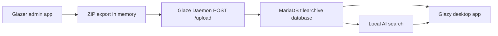

# Glazed

Glazed is a local ceramic tile glaze archive system. It helps users digitize tile boards, import cropped tile records into MariaDB, and search the archive with filters or local AI.

## Components

- `glazer_admin/`: React annotation app for uploading board photos and drawing tile boxes.
- `glaze_daemon/`: FastAPI import service that receives annotation exports and writes to MariaDB.
- `glazy_app/`: Avalonia desktop search app.
- `ai-search-prototype/`: local CLIP-based natural-language search.
- `compose.yaml`: Podman Compose services for the frontend, backend, and MariaDB.

## Prerequisites

- Podman
- Podman Compose support, usually available as `podman compose`
- Node.js 18 or newer, only needed for local AI search or frontend development outside containers
- .NET SDK 8, only needed to build the desktop app

## Quick Start

Clone with submodules:

```bash
git clone --recurse-submodules https://github.com/cacticouncil/glazed.git
cd glazed
```

Create local environment settings:

```bash
cp .env.example .env
```

Start the services:

```bash
podman compose up -d --build
```

A fresh clone creates a new empty MariaDB volume. Import tile exports through the Glazer admin app, run the metadata backfill for older rows if needed, or restore a shared database dump if the team wants everyone to start with the same test data. Local AI model files, image samples, visual metrics, and embeddings are regenerated on each machine and are ignored by Git.

Open:

- Glazer admin app: [http://localhost](http://localhost)
- Glaze Daemon API docs: [http://localhost:8000/docs](http://localhost:8000/docs)
- MariaDB: `localhost:3306`

Do not open `localhost:3306` in a browser. It is the database protocol, not HTTP.

## Data Flow



## Podman Commands

Start or rebuild everything:

```bash
podman compose up -d --build
```

Stop services:

```bash
podman compose down
```

Reset the database volume:

```bash
podman compose down -v
podman compose up -d --build
```

Warning: `podman compose down -v` deletes the local database volume.

View service logs:

```bash
podman compose logs glaze-daemon
podman compose logs tile-db
```

Check tile count:

```bash
set -a
source .env
set +a

podman compose exec -T tile-db mariadb \
  -u"$DB_USER" -p"$DB_PASSWORD" "$MYSQL_DATABASE" \
  -e "SELECT COUNT(*) AS tiles FROM testpiece;"
```

## Glazer Admin

Location: `glazer_admin/`

The admin app is used to:

- Upload board or tile images.
- Draw bounding boxes around individual tiles.
- Edit annotation metadata.
- Export cropped tile images and metadata to the backend.

Development commands:

```bash
cd glazer_admin
npm install
npm run dev
npm run build
```

## Glaze Daemon

Location: `glaze_daemon/`

The daemon accepts the Glazer export at:

```text
POST /upload
```

It imports cropped tile images into MariaDB and generates automatic metadata:

- `AutoTags`
- `AutoKeywords`
- `PrimaryColor`
- `ColorProfile`
- `DominantColors`

The richer color fields make search better for multi-color tiles. For example, a mostly blue tile with small black/red areas can still be found as blue because `ColorProfile` stores color percentages instead of only one averaged LAB value.

## Database

The default database is `tilearchive`.

Main schema:

- `glaze_daemon/db-schema.sql`

Important tables:

- `testpiece`: tile image, LAB values, dominant color metadata, firing info, generated tags, and generated keywords.
- `glazetype`: glaze type lookup table.
- `surfacecondition`: surface condition lookup table.
- `tileboard`: board-level records.
- `view_testpiece_full`: joined view for fuller tile data.

## Backfill Existing Rows

New uploads get automatic tags and color metadata during import.

For older rows already in the database, run:

```bash
podman compose exec glaze-daemon python backfill_auto_metadata.py
```

## Glazy Desktop App

Location: `glazy_app/`

Build:

```bash
cd glazy_app
dotnet build "ASTEM DB.csproj"
```

Run:

```bash
cd glazy_app
dotnet run --project "ASTEM DB.csproj"
```

Publish a self-contained build:

```bash
cd glazy_app
dotnet publish "ASTEM DB.csproj" -c Release -r osx-arm64 --self-contained true -o publish/osx-arm64
```

Use the runtime identifier for your platform, such as:

- `osx-arm64`
- `osx-x64`
- `linux-x64`
- `win-x64`

The desktop app reads DB settings from environment variables when available. If `DB_HOST=tile-db`, it automatically uses `127.0.0.1` for host-side desktop access.

## Local AI Search

Location: `ai-search-prototype/`

The Glazy desktop app has an AI Chat Search tab. Each message refines the current search context, so a follow-up like `something darker` after `give me something brown` is searched as a darker brown tile. Use the tab's reset button to start a new AI search context.

The AI tab also includes an `Image` button. It currently opens an image picker and stores the selected image path in the desktop app state, but visual image-to-tile ranking is intentionally not implemented here yet. The image-search team can connect their pipeline through `AiSearchImagePath` / `SetPendingAiSearchImage(...)` in `glazy_app/ViewModels/MainWindowViewModel.cs`.

Install dependencies:

```bash
cd ai-search-prototype
npm install
```

Run a first-time search. This downloads the CLIP model into `ai-search-prototype/model-cache` if it is not already cached:

```bash
set -a
source ../.env
set +a

ALLOW_REMOTE=1 \
CLIP_MODEL=Xenova/clip-vit-base-patch16 \
node search.mjs "blue cold tile"
```

After the model is cached, use local-only mode:

```bash
ALLOW_REMOTE=0 node search.mjs "blue cold tile"
```

The desktop app allows the first download by default, then reuses the local cache. Set `ALLOW_REMOTE=0` before launching the desktop app if you want strictly offline AI search.

AI search combines:

- CLIP text-to-image similarity.
- Dominant color/profile scoring for color words.
- Metadata scoring from automatic tags, keywords, glaze type, surface condition, firing type, and soil type.
- Visual edge scoring for constraints like `no dark edges`, `no brown borders`, or `no edges`.

First-run speed is controlled by `EMBEDDING_PREFILTER` in `.env`.

- `EMBEDDING_PREFILTER=60` embeds only the strongest initial candidates and is faster for development.
- `EMBEDDING_PREFILTER=0` embeds every missing tile image before ranking and is better for warming a full local cache.

The desktop app also uses a persistent local AI worker by default:

- `AI_SEARCH_WORKER=1` keeps the Node/CLIP process open while the app is running, so follow-up chat searches do not reload the model.
- `AI_SEARCH_WORKER=0` disables the worker and runs one Node process per search, which is slower but useful for debugging.

AI ranking can be trained from feedback:

- Select an AI result tile in the desktop app.
- Use the AI Training buttons: `Good`, `Bad`, `Color`, or `Edges`.
- Click `Train Weights` to update `ai-search-prototype/training-data/ranking-weights.json`.

The feedback log is local and ignored by Git:

```text
ai-search-prototype/training-data/feedback.jsonl
```

The trained weights file can be committed if the team wants to share the tuned ranking behavior.

## Common Prompts

```text
blue cold tile
dark glossy tile
warm rustic brown tile
cream tile with red accent
dark blue sea
no dark edges
something darker
```

## Troubleshooting

### Submodules are empty

Run:

```bash
git submodule update --init --recursive
```

### Services do not start

Check:

```bash
podman compose ps
podman compose logs glaze-daemon
podman compose logs tile-db
```

### Export completes but no tiles appear

Check backend logs and database row count:

```bash
podman compose logs glaze-daemon

set -a
source .env
set +a

podman compose exec -T tile-db mariadb \
  -u"$DB_USER" -p"$DB_PASSWORD" "$MYSQL_DATABASE" \
  -e "SELECT COUNT(*) FROM testpiece;"
```

### AI search is slow the first time

The first search downloads the local CLIP model if needed, computes visual metrics, and caches image embeddings under:

```text
ai-search-prototype/model-cache/
ai-search-prototype/visual-cache/
ai-search-prototype/embedding-cache/
```

Later searches are faster unless new tile images are added. Keep `EMBEDDING_PREFILTER=60` for faster first searches, or set `EMBEDDING_PREFILTER=0` when you want to warm the full cache.

## Development Notes

- Glazer creates annotation exports.
- Glaze Daemon owns database import logic.
- MariaDB is the source of truth after import.
- Glazy reads from MariaDB.
- Local AI search ranks database tiles and returns matching IDs.
- Commit submodule changes inside `glaze_daemon/`, `glazer_admin/`, and `glazy_app/` first, then commit the updated submodule pointers in this top-level repo.
- Do not commit generated local files such as `.env`, `data/`, `node_modules/`, `ai-search-prototype/model-cache/`, `ai-search-prototype/embedding-cache/`, `ai-search-prototype/visual-cache/`, or `ai-search-prototype/sample-images/`.
- Commit `ai-search-prototype/package-lock.json` and `ai-search-prototype/training-data/ranking-weights.json` when the team wants the same dependency versions and tuned ranking behavior.
